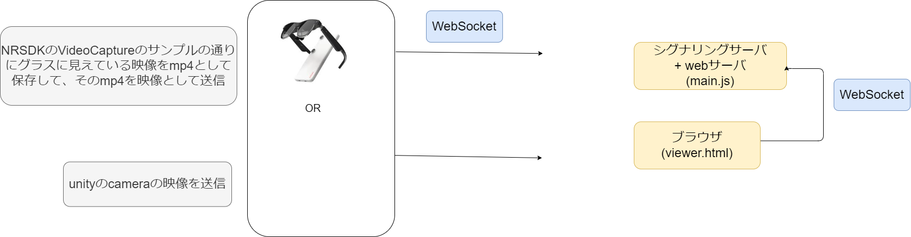
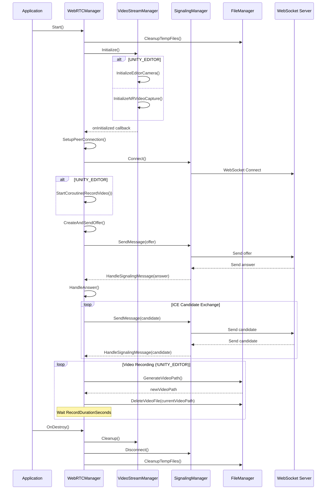

# 構成イメージ

# シーケンス図

```mermaid
sequenceDiagram
    participant App as Application
    participant WM as WebRTCManager
    participant VM as VideoStreamManager
    participant SM as SignalingManager
    participant FM as FileManager
    participant WS as WebSocket Server

    App->>WM: Start()
    WM->>FM: CleanupTempFiles()
    WM->>VM: Initialize()

    alt UNITY_EDITOR
        VM->>VM: InitializeEditorCamera()
    else
        VM->>VM: InitializeNRVideoCapture()
    end

    VM-->>WM: onInitialized callback
    WM->>WM: SetupPeerConnection()
    WM->>SM: Connect()
    SM->>WS: WebSocket Connect

    alt !UNITY_EDITOR
        WM->>WM: StartCoroutine(RecordVideo())
    end

    WM->>WM: CreateAndSendOffer()
    WM->>SM: SendMessage(offer)
    SM->>WS: Send offer

    WS-->>SM: Send answer
    SM-->>WM: HandleSignalingMessage(answer)
    WM->>WM: HandleAnswer()

    loop ICE Candidate Exchange
        WM->>SM: SendMessage(candidate)
        SM->>WS: Send candidate
        WS-->>SM: Send candidate
        SM-->>WM: HandleSignalingMessage(candidate)
    end

    loop Video Recording (!UNITY_EDITOR)
        WM->>FM: GenerateVideoPath()
        FM-->>WM: newVideoPath
        WM->>FM: DeleteVideoFile(currentVideoPath)
        Note over WM: Wait RecordDurationSeconds
    end

    App->>WM: OnDestroy()
    WM->>VM: Cleanup()
    WM->>SM: Disconnect()
    WM->>FM: CleanupTempFiles()
```
